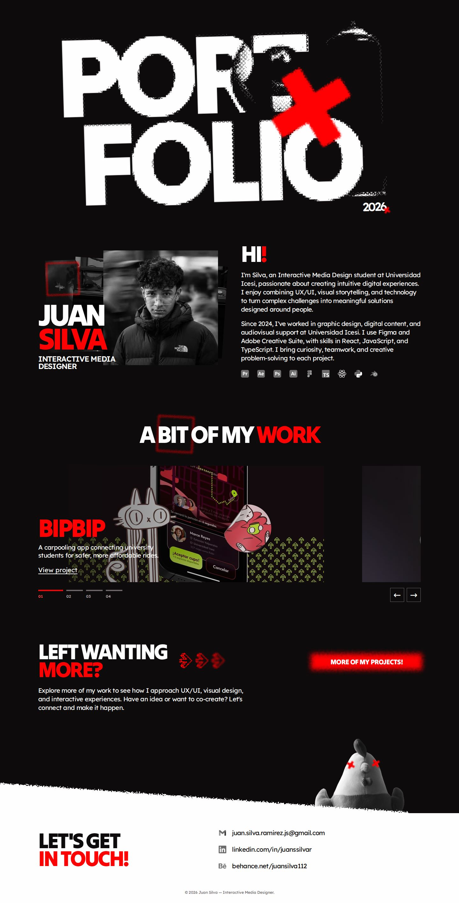
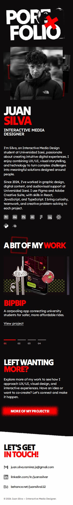

# Responsive portfolio review

The fixed 1440 px canvas has been replaced with a responsive layout capped at 1200 px. The hero has its own 1140 px cap; portraits and body copy stop growing on large monitors. The mobile year and other previously hidden decorative elements remain hidden.

The shared project carousel uses native horizontal scrolling with CSS scroll snap. Touch input, indicators, previous/next buttons and keyboard navigation update the same project selection. Decorative crosses are anchored to their artwork; textured squares, button and footer assets preserve the original visual direction. Lexend and Tilt Warp are served locally with their font licenses.

Project images now use responsive WebP files: all four total 0.35 MB at 1600 px or 0.14 MB at 800 px, compared with about 12.7 MB for the original PNGs. The original source images remain available for regeneration with `npm run optimize:images`.

## Validation — 2026-09-30

- `npm run typecheck`: passed.
- `npm test`: all 6 tests passed, covering navigation, native scrolling, interrupted navigation, keyboard controls, reduced motion and landmarks.
- `npm run build`: passed.
- `git diff --check`: passed.
- Headless Chromium against the production build at 320, 390, 767, 768, 1024, 1440 and 1920 px: no page horizontal overflow or broken loaded images. Screenshots reviewed for responsive composition.
- Chromium mobile context at 390 px with CDP touch start/move/end input: swiped through all four projects and back. Verified Lumi's title, link and selected indicator after the initial swipe. No pagination click or programmatic scroll was used for these gestures.
- Mobile year remains hidden; desktop portrait is capped at 360 px and biography at 20 px.

This is browser emulation, not a physical iPhone/Android or Safari test. An actual-device check is still useful during review.

## Desktop — 1440 px

## Mobile — 390 px

